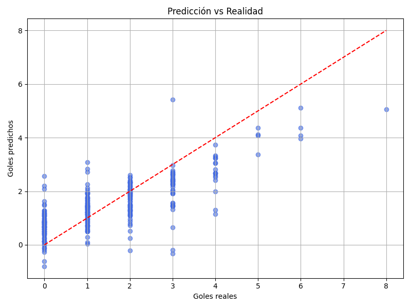

# Predicción de Goles en Partidos de Fútbol (FIFA World Cup)

Este proyecto consiste en desarrollar un modelo de Machine Learning capaz de **predecir la cantidad de goles del equipo local** en un partido de fútbol, utilizando estadísticas reales de encuentros anteriores de la Copa Mundial de la FIFA.

Se emplea un enfoque de **aprendizaje supervisado con regresión**, entrenando al modelo con información numérica del partido (posesión, remates, tarjetas, etc.) para que aprenda a estimar cuántos goles podría marcar el equipo local en futuros partidos similares.

## Dataset

- **Fuente**: [FIFA World Cup Match Stats - Kaggle](https://www.kaggle.com/datasets/abecklas/fifa-world-cup)
- **Descripción**: Contiene estadísticas detalladas de cientos de partidos internacionales, incluyendo posesión, remates, tarjetas, faltas, etc.
- **Uso**: Se procesó y filtró para conservar únicamente columnas numéricas relevantes para la predicción de goles.

## Tecnologías utilizadas

| Herramienta        | Rol en el proyecto                                                   |
|--------------------|----------------------------------------------------------------------|
| **Python**         | Lenguaje principal del desarrollo                                    |
| **pandas**         | Carga, limpieza y análisis de datos en formato tabular               |
| **scikit-learn**   | Separación de datos, entrenamiento del modelo, evaluación de métricas|
| **TensorFlow**     | Entrenamiento de modelos más complejos (redes neuronales)            |
| **matplotlib**     | Visualización de resultados y métricas                               |

## Metodología

- **Regresión supervisada**: el modelo predice un valor numérico continuo (goles).
- **Normalización de datos**: para escalar las variables y mejorar el rendimiento del modelo.
- **Red neuronal básica**: construida con TensorFlow y entrenada para ajustar los datos.
- **Métricas de evaluación**:
  - **MAE (Mean Absolute Error)**: error promedio entre los valores reales y los predichos.
  - **RMSE (Root Mean Squared Error)**: penaliza errores grandes, útil para evaluar precisión.

Este proyecto busca no solo aplicar técnicas de ML sobre datos deportivos reales, sino también ser una prueba práctica de conocimientos en programación, análisis de datos y aprendizaje automático.

**Machine Learning (ML)** es una rama de la inteligencia artificial que permite a las computadoras aprender de los datos y hacer predicciones o tomar decisiones sin estar programadas explícitamente para cada caso.

Existen varios tipos de aprendizaje automático, entre los más comunes están:

- **Aprendizaje supervisado**: El modelo aprende a partir de un conjunto de datos etiquetado, es decir, cada ejemplo tiene una entrada (features) y una salida (target) conocida. Es ideal para tareas como predicción de precios, clasificación de imágenes o, en este caso, predicción de goles.

- **Aprendizaje no supervisado**: No hay etiquetas. El modelo intenta encontrar estructuras ocultas en los datos. Se usa en agrupamientos (clustering) o reducción de dimensionalidad.

- **Aprendizaje por refuerzo**: El modelo aprende tomando decisiones en un entorno y recibe recompensas o penalizaciones en función de su comportamiento. Se utiliza mucho en juegos, robótica y sistemas de recomendación.

### ¿Qué tipo de aprendizaje usamos en este proyecto?

Este proyecto utiliza **aprendizaje supervisado** con un modelo de **regresión**, ya que buscamos predecir un valor numérico continuo: la cantidad de goles que hará el equipo local en un partido de fútbol, a partir de estadísticas del encuentro.

---

# Indice
- [Setup del entorno de desarrollo](#setup-del-entorno-de-desarrollo)
  - [Instalación de Python](#instalación-de-python)
  - [Entorno virtual](#entorno-virtual)
  - [Instalación de librerías](#instalación-de-librerías)
  - [Configuración de Git y GitHub](#configuración-de-git-y-github)
  - [Archivo .gitignore](#archivo-gitignore)
- [Preprocesamiento y preparación de los datos](#preprocesamiento-y-preparación-de-los-datos)
  - [Carga y exploración inicial del dataset](#carga-y-exploración-inicial-del-dataset)
  - [Selección y limpieza de datos](#selección-y-limpieza-de-datos)
  - [Separación en features y target](#separación-en-features-y-target)
  - [Separación en conjunto de entrenamiento y prueba](#separación-en-conjunto-de-entrenamiento-y-prueba)
  - [Escalado de características (normalización)](#escalado-de-características-normalización)
- [Modelado y entrenamiento](#modelado-y-entrenamiento)
  - [Entrenamiento del modelo (Regresión Lineal)](#entrenamiento-del-modelo-regresión-lineal)
  - [Evaluación del Modelo](#evaluación-del-modelo)
- [Visualización y presentación](#visualización-y-presentación)
  - [Visualización de Resultados](#visualización-de-resultados)
  - [Análisis de Resultados y Conclusiones](#análisis-de-resultados-y-conclusiones)
---
# Setup del entorno de desarrollo

Este proyecto fue desarrollado en macOS utilizando Python y librerías de Machine Learning. A continuación se detalla el proceso completo de instalación, configuración del entorno virtual y setup del repositorio en GitHub.

## Instalación de Python

Primero instalé Python utilizando [Homebrew](https://brew.sh/), el gestor de paquetes para macOS:

```bash
brew install python
```
Luego verifiqué que la instalación fue exitosa:

```bash
python3 --version
pip3 --version
```

## Entorno virtual

Un entorno virtual es un espacio aislado donde se instalan las librerías de Python para un solo proyecto.
Esto evita conflictos entre proyectos distintos que usan diferentes versiones de las mismas librerías.

- Desde la raíz del proyecto:
```bash
python3 -m venv futbol-env
```
- Luego activé el entorno con:
```bash
source futbol-env/bin/activate
```
Nota: Cada vez que vuelvo a trabajar en el proyecto, debo reactivar el entorno con el mismo comando.

## Instalación de librerías
Con el entorno virtual activado, instalé las librerías necesarias para trabajar con análisis de datos, visualización, Machine Learning y redes neuronales:
```bash
pip install pandas numpy matplotlib seaborn scikit-learn tensorflow
```
Luego guardé esas dependencias en un archivo para que cualquier persona pueda instalarlas fácilmente:
```bash
pip freeze > requirements.txt
```
Si qusiera instalar todo en otra máquina con el mismo entorno virtual:
```bash
pip install -r requirements.txt
```
## Configuración de Git y GitHub
Inicialicé el repositorio Git dentro del proyecto:
```bash
git init
```
Luego conecté mi repositorio local con uno ya creado en GitHub:
```bash
git remote add origin https://github.com/ManuPerez182/Prediccion-de-goles-en-futbol-con-Machine-Learning.git
```
Agregué y subí los primeros archivos al repositorio remoto:
```bash
git add .
git commit -m "Primer commit con estructura del proyecto"
git push -u origin main
```
## Archivo .gitignore
Para evitar subir archivos innecesarios o generados automáticamente, creé un archivo .gitignore con el siguiente contenido:
```bash
# Entorno virtual
futbol-env/

# Archivos temporales y compilados
__pycache__/
*.py[cod]
*.log
.vscode/
.DS_Store

# Modelos y datasets locales
*.h5
Dataset/
```
---
# Preprocesamiento y preparación de los datos

En esta sección realizamos todos los pasos necesarios para dejar el dataset listo para ser utilizado por nuestro modelo de Machine Learning. Estos pasos incluyen:

- Cargar y explorar los datos
- Seleccionar variables relevantes
- Limpiar datos innecesarios o incompletos
- Separar variables predictoras (features) y objetivo (target)
- Dividir en conjuntos de entrenamiento y prueba

Todo esto forma parte de lo que se conoce como pipeline de preprocesamiento.

Un **pipeline de preprocesamiento** es la secuencia ordenada de pasos que aplicamos a los datos antes de entrenar un modelo de Machine Learning.

El objetivo es preparar los datos de forma estandarizada y reproducible, asegurando que el modelo trabaje con información limpia, consistente y adecuada.

## Carga y exploración inicial del dataset

En este primer paso vamos a cargar el dataset `match_stats.csv`, que contiene estadísticas de partidos de fútbol internacional. El archivo está ubicado dentro de la carpeta `Dataset/`.

Para esta tarea utilizamos la librería **pandas**.

###  ¿Qué es pandas?

`pandas` es una librería de Python especializada en el manejo y análisis de datos estructurados, como tablas. Su estructura principal se llama **DataFrame**, y permite trabajar con los datos de forma similar a una planilla de cálculo (como Excel), pero usando código.

Es una herramienta esencial en cualquier proyecto de Machine Learning porque nos permite:

- Cargar datasets (CSV, Excel, SQL, etc.)
- Filtrar y transformar columnas
- Eliminar datos vacíos
- Realizar análisis y limpieza previa al entrenamiento del modelo

### Código

```python
import pandas as pd

# Cargar el archivo CSV dentro de la carpeta Dataset
df = pd.read_csv("Dataset/match_stats.csv")

# Mostrar las primeras filas del dataset
print(df.head())

# Ver información general de las columnas y tipos de datos
print(df.info())
```
## Selección y limpieza de datos

Una vez que cargamos el dataset, es importante preparar los datos correctamente para el modelo de Machine Learning. Esto implica dos pasos principales: seleccionar solo las columnas útiles y limpiar los datos si es necesario.

Como queremos predecir la cantidad de goles del equipo local (`hgoals`), seleccionamos únicamente las columnas **numéricas** relacionadas al rendimiento del equipo local.

### ¿Por qué seleccionamos solo columnas numéricas?

En Machine Learning, los modelos trabajan exclusivamente con datos numéricos. Por eso, descartamos columnas con texto (como los nombres de los equipos) o información que no aporta directamente a la predicción que queremos hacer.

Nos quedamos con columnas que:
- Contienen datos **cuantificables** (por ejemplo: posesión, remates, faltas).
- Están relacionadas al **rendimiento del equipo local y visitante**.
- Están listas para usarse sin procesamiento adicional.

Esta técnica se llama **Feature Selection**

Es una parte fundamental del **preprocesamiento de datos** en Machine Learning. Tiene como objetivo:

- Eliminar ruido o datos irrelevantes
- Reducir la complejidad del modelo (menos columnas = menos esfuerzo computacional)
- Mejorar la calidad del entrenamiento
- Evitar el sobreajuste (*overfitting*)

### Código

```python
# Selección de columnas numéricas útiles
df_model = df[[
    'hgoals',         # Target: goles del equipo local
    'hPossesion',
    'hshots',
    'hshotsOnTarget',
    'hfouls',
    'hyellowCards',
    'hredCards',
    'hsaves'
]]
# Filtrar el DataFrame para quedarnos solo con las columnas relevantes
df = df[columns]
```
## Separación en features y target

En Machine Learning supervisado, el objetivo es que el modelo **aprenda a hacer predicciones basándose en ejemplos anteriores**. Para lograr esto, es necesario separar los datos en dos componentes fundamentales:

- **Features (`X`)**: Son las variables de entrada, también conocidas como características. Contienen la información que el modelo va a analizar para intentar encontrar patrones. En nuestro caso, estas variables incluyen estadísticas como la posesión, remates al arco, tarjetas y otras métricas del rendimiento de los equipos.

- **Target (`y`)**: Es la variable de salida u objetivo. Representa el valor que queremos que el modelo aprenda a predecir. En este proyecto, la variable objetivo es `hgoals`, es decir, la cantidad de goles que hace el equipo local.

Separar estos dos componentes permite al modelo construir una **relación matemática o estadística entre los inputs (`X`) y el output (`y`)**. Durante el entrenamiento, el modelo analiza cómo cambian los valores de `y` en función de las distintas combinaciones de valores en `X`. Así, cuando reciba nuevos datos similares, podrá estimar cuál sería el valor de salida más probable.

Este paso es clave para todo el proceso de entrenamiento y evaluación, y se aplica en la mayoría de los modelos de regresión, clasificación y predicción.

### Código

```python
# 'hgoals' es la variable target
y = df['hgoals']

# Todas las demás columnas son features
X = df.drop('hgoals', axis=1)

# Verificamos las dimensiones
print("Tamaño de X:", X.shape)
print("Tamaño de y:", y.shape)
```
## Separación en conjunto de entrenamiento y prueba

Antes de entrenar nuestro modelo, es fundamental dividir el dataset en dos partes:

- **Conjunto de entrenamiento** (`train`): con el que el modelo aprenderá.
- **Conjunto de prueba** (`test`): con el que evaluaremos qué tan bien predice el modelo con datos que nunca vio.

Esta práctica es clave en el **aprendizaje supervisado**, ya que permite comprobar si el modelo realmente generaliza o simplemente memorizó los datos.

Dividir el dataset nos ayuda a:

- Detectar sobreajuste (cuando el modelo aprende demasiado bien los datos de entrenamiento y falla en datos nuevos).
- Obtener una métrica objetiva de rendimiento sobre datos "no vistos".

Una división habitual es **80% para entrenamiento y 20% para prueba**.

### ¿Qué es `scikit-learn`?

[`scikit-learn`](https://scikit-learn.org/) es una de las librerías más utilizadas para Machine Learning en Python. Nos proporciona herramientas para:

- Entrenar modelos de regresión y clasificación
- Preprocesar y transformar datos
- Evaluar modelos con métricas estándar
- Automatizar flujos de trabajo con pipelines

### ¿Qué hace `train_test_split`?

Es una función que permite dividir fácilmente los datos en conjunto de entrenamiento y prueba. Pertenece al módulo `sklearn.model_selection`.

- `X`: representa las features del partido (posesión, remates, faltas, etc.).

- `y`: representa el target (cantidad de goles del equipo local).

- `test_size=0.2`: 20% del dataset se destina a prueba.

- `random_state=42`: asegura que la división siempre sea la misma si se vuelve a ejecutar.

**El resultado son 4 conjuntos:**

- `X_train`, `y_train`: para entrenar el modelo

- `X_test`, `y_test`: para probar el modelo

### Código

```python
# División en 80% entrenamiento y 20% prueba
X_train, X_test, y_train, y_test = train_test_split(
    X, y, test_size=0.2, random_state=42
)
```
## Escalado de características (normalización)

### ¿Qué es la normalización?

En Machine Learning, las variables o "features" pueden tener escalas muy diferentes. Por ejemplo:

- Posesión del balón: valores entre 0 y 100
- Tarjetas rojas: normalmente entre 0 y 2

Esta diferencia en escala puede hacer que el modelo le dé **más importancia a unas variables que a otras**, simplemente por su magnitud numérica, y no porque realmente sean más relevantes.

### ¿Por qué normalizar?

- Mejora el rendimiento de muchos algoritmos (especialmente regresión, redes neuronales, SVM, etc.)
- Acelera la convergencia durante el entrenamiento
- Previene inestabilidades numéricas
- Hace que todas las features "jueguen en igualdad de condiciones"

### ¿Qué técnica usamos?

Usamos `StandardScaler`, una herramienta de `scikit-learn` que aplica la fórmula de normalización estándar:

**z = (x - media) / desviación_estándar**

Esto transforma los datos para que tengan:

- Media ≈ 0
- Desviación estándar ≈ 1

### ¿Qué es un scaler?

Un **scaler** es una herramienta de preprocesamiento en Machine Learning que sirve para **ajustar las escalas de las variables numéricas**, así el modelo no se ve influenciado por la magnitud numérica, sino por la relevancia real de cada variable.

- `scaler = StandardScaler()`: Crea una instancia del escalador, aún sin aplicarlo.

- `fit_transform(X_train)`: Calcula la media y desviación estándar de cada columna (fit) y aplica la transformación a los datos (transform)

- `transform(X_test)`: Aplica la misma transformación al conjunto de prueba, usando los parámetros aprendidos con el entrenamiento.

### Buenas prácticas aplicadas

- El `.fit()` solo se hace con los datos de entrenamiento, para no "contaminar" el modelo con información del test.

- Se aplica `.transform()` al test para garantizar que reciba exactamente la misma transformación matemática.

- Esto simula un escenario real: el modelo nunca ve datos del test mientras aprende.

### Código

```python
# Crear el objeto scaler
scaler = StandardScaler()

# Ajustar y transformar los datos de entrenamiento
X_train_scaled = scaler.fit_transform(X_train)

# Usar el mismo scaler para transformar el test
X_test_scaled = scaler.transform(X_test)
```
---
# Modelado y entrenamiento

## Entrenamiento del modelo (Regresión Lineal)

### ¿Qué es la regresión lineal?

La regresión lineal es uno de los modelos más simples y utilizados en el aprendizaje automático supervisado. Se emplea cuando queremos **predecir un valor numérico continuo** a partir de una o más variables independientes. En este proyecto, la regresión lineal se utiliza para **predecir la cantidad de goles que marcará el equipo local** en un partido de fútbol, a partir de estadísticas como posesión, remates, tarjetas, etc.

### ¿Cómo funciona?

- La regresión lineal intenta encontrar una **función matemática lineal** que relacione las variables independientes (features) con la variable dependiente (target).
- Con una sola variable, la relación es: **y = m * x + b**
    - m = pendiente (coeficiente que multiplica la variable x)
    - b = término independiente (constante)
- En nuestro caso, tenemos varias features, por lo que usamos la regresión lineal múltiple: **y = a1 * x1 + a2 * x2 +⋯+ an * xn + b** Aquí, cada a_i es un coeficiente que indica el peso de cada feature.

El modelo aprende esos coeficientes durante el entrenamiento, buscando minimizar la diferencia entre los valores reales y los predichos.

### Explicación del código
- `LinearRegression()`: Crea una instancia del modelo de regresión lineal. Aún no está entrenado.

- `model.fit(X_train_scaled, y_train)`: Entrena el modelo usando los datos normalizados de entrenamiento. Aprende los coeficientes óptimos para cada feature.

- `model.predict(X_test_scaled)`: Usa el modelo entrenado para predecir la cantidad de goles del equipo local en partidos nuevos (conjunto de prueba).

### Buenas prácticas

- Solo se entrena (fit) con el conjunto de entrenamiento. El conjunto de prueba se usa únicamente para evaluación.

- Las predicciones deben hacerse con los datos normalizados usando el mismo scaler que se entrenó previamente.

- Siempre se guarda la predicción (y_pred) para compararla luego con los valores reales (y_test).

### Código

```python
# Crear el modelo
model = LinearRegression()

# Entrenar el modelo con los datos normalizados
model.fit(X_train_scaled, y_train)

# Realizar predicciones con el conjunto de prueba
y_pred = model.predict(X_test_scaled)
```
## Evaluación del Modelo

Una vez entrenado el modelo, debemos evaluar su rendimiento sobre el conjunto de prueba (`X_test`, `y_test`). Esto nos permite medir qué tan bien generaliza a datos nuevos que **no ha visto** durante el entrenamiento.

Como estamos trabajando con un modelo de **regresión**, utilizamos métricas específicas para este tipo de problema. Las métricas nos dicen cuánto se están alejando las predicciones de los valores reales, y qué tan bien se ajusta el modelo a los datos.

### Métricas utilizadas

#### MAE – Mean Absolute Error (Error Absoluto Medio)

- Mide el **promedio de las diferencias absolutas** entre los valores reales y las predicciones.
- Fácil de interpretar: si MAE = 1.2 → el modelo se equivoca por 1.2 goles en promedio.
- No penaliza tanto los errores grandes.

$$
MAE = \frac{1}{n} \sum_{i=1}^{n} |y_i - \hat{y}_i|
$$

#### MSE – Mean Squared Error (Error Cuadrático Medio)

- Eleva al cuadrado las diferencias antes de promediarlas.
- Penaliza más los errores grandes.
- No es tan fácil de interpretar porque está en unidades cuadradas (goles²).

$$
MSE = \frac{1}{n} \sum_{i=1}^{n} (y_i - \hat{y}_i)^2
$$

#### RMSE – Root Mean Squared Error

- Es la **raíz cuadrada** del MSE.
- Devuelve los errores en la misma unidad que el target (goles).
- Muy usada como métrica general de error.

$$
RMSE = \sqrt{ \frac{1}{n} \sum_{i=1}^{n} (y_i - \hat{y}_i)^2 }
$$

#### R² – Coeficiente de Determinación

- Mide qué tan bien el modelo explica la variabilidad del target (`y_test`).
- Va de 0 a 1 (aunque puede ser negativo si el modelo es muy malo).
- Ej: R² = 0.85 → el modelo explica el 85% de la variación en los goles anotados.

$$
R^2 = 1 - \frac{ \sum_{i=1}^{n} (y_i - \hat{y}_i)^2 }{ \sum_{i=1}^{n} (y_i - \bar{y})^2 }
$$

### Explicación del codigo

- `mean_absolute_error(y_test, y_pred)`: Calcula el promedio del valor absoluto de los errores entre las predicciones y los valores reales.
→ Ej: MAE = 0.9 → el modelo se equivoca en promedio por 0.9 goles.

- `mean_squared_error(y_test, y_pred)`: Eleva cada error al cuadrado antes de promediarlo.
Penaliza más los errores grandes.

- `np.sqrt(mse)`: Toma la raíz cuadrada del MSE para obtener una métrica más fácil de interpretar (RMSE).

- `r2_score(y_test, y_pred)`: Calcula qué tan bien se ajusta el modelo a los datos.
Un R² = 0.85 significa que el 85% de la variabilidad en los goles puede ser explicada por el modelo.

### Código

```python
# MAE: Error absoluto medio
mae = mean_absolute_error(y_test, y_pred)

# MSE y RMSE
mse = mean_squared_error(y_test, y_pred)
rmse = np.sqrt(mse)

# R²: Coeficiente de determinación
r2 = r2_score(y_test, y_pred)

# Mostramos los resultados
print("MAE:", mae)
print("RMSE:", rmse)
print("R²:", r2)
```
---
# Visualización y presentación

## Visualización de Resultados

Una vez entrenado y evaluado el modelo con métricas numéricas, es importante **visualizar los resultados** para tener una mejor comprensión de su rendimiento. La visualización complementa los valores estadísticos y nos ayuda a detectar patrones o errores sistemáticos.

### ¿Qué es `matplotlib`?

[`matplotlib`](https://matplotlib.org/) es una biblioteca de visualización en Python ampliamente utilizada para crear gráficos estáticos, animados e interactivos. En este proyecto usamos `matplotlib.pyplot`, que provee una interfaz similar a MATLAB para generar gráficos con pocas líneas de código.

### ¿Qué es un gráfico de dispersión (`scatter plot`)?

Un **gráfico de dispersión** es una herramienta visual que permite analizar la relación entre dos variables numéricas.

En nuestro caso:

- El eje **X** representa los **goles reales** (`y_test`)
- El eje **Y** representa los **goles predichos** (`y_pred`)

Si el modelo fuera perfecto, **todos los puntos caerían sobre la diagonal** (`y = x`), lo que indicaría que el valor predicho coincide con el valor real.

Este tipo de visualización es clave para detectar:

- Predicciones sistemáticamente altas o bajas
- Alta dispersión en ciertos rangos
- Posibles sesgos del modelo

### Código

```python
# Crear la figura
plt.figure(figsize=(8, 6))

# Dibuja los puntos: cada punto representa un partido
plt.scatter(y_test, y_pred, color='royalblue', alpha=0.6)

# Dibuja la línea y = x (ideal)
plt.plot([y_test.min(), y_test.max()], [y_test.min(), y_test.max()], 'r--')

# Etiquetas y formato
plt.xlabel('Goles reales')
plt.ylabel('Goles predichos')
plt.title('Predicción vs Realidad')
plt.grid(True)
plt.tight_layout()
plt.show()
```

## Análisis de Resultados y Conclusiones

### Evaluación general del modelo

El modelo de regresión fue entrenado para predecir la cantidad de goles anotados por el equipo local utilizando estadísticas previas al resultado (posesión, remates, tarjetas, faltas, etc.). A continuación se presentan las métricas obtenidas:

- **MAE:** 0.71 → En promedio, el modelo se equivoca por ~0.71 goles.
- **RMSE:** 0.91 → El error promedio ponderado (penalizando más los errores grandes) es menor a 1 gol.
- **R²:** 0.57 → El modelo explica el **57%** de la variabilidad en los goles anotados.

Estas métricas indican que el modelo logra capturar una parte significativa del comportamiento del target, aunque todavía queda margen de mejora.

### Precisión de las predicciones

Analizamos el margen de error en las predicciones para clasificar su precisión:

| Categoría                       | Criterio                  | Porcentaje |
|--------------------------------|---------------------------|------------|
| Predicción exacta           | Error = 0                 | 0.00%      |
| Error moderado              | Error ≤ 1 gol             | 79.80%     |
| Error grande                | Error > 1 gol             | 20.20%     |

El **80% de las predicciones están dentro de un margen razonable (≤ 1 gol)**, lo cual es un resultado positivo para un modelo sencillo, sin ajustes avanzados.


### Interpretación del gráfico



- **Eje X:** Goles reales del equipo local.
- **Eje Y:** Goles predichos por el modelo.
- **Línea negra (y = x):** Representa la predicción perfecta.
- **Colores:**
  - Azul: Predicción con error ≤ 1 gol (moderada).
  - Rojo: Predicción con error > 1 gol (grande).

Como puede verse, la mayoría de los puntos están cerca de la línea negra, aunque el modelo tiende a **subestimar ligeramente los goles** cuando son altos, y a **sobrestimarlos cuando son bajos**. Esto es una señal de que el modelo **no captura completamente los extremos** del target (goles muy altos o muy bajos).

### Conclusiones

- El modelo presenta un rendimiento **razonable para un primer enfoque básico**, utilizando regresión lineal con datos crudos y sin ajuste fino.
- No logra predicciones exactas, pero tiene **un error promedio bajo y buena cobertura general**.
- El desempeño podría mejorar aplicando:
  - Técnicas de **feature engineering** más sofisticadas.
  - **Modelos no lineales** como árboles de decisión, Random Forest o redes neuronales.
  - **Ajustes de hiperparámetros** o técnicas de regularización.
  - Más datos (por ejemplo, estadísticas individuales, localía real, ranking FIFA, etc.).

 **Este proyecto representa una excelente introducción práctica al aprendizaje automático supervisado con regresión.** Fue desarrollado con el objetivo de aprender haciendo, y demuestra habilidades en análisis de datos, preprocesamiento, entrenamiento de modelos y evaluación de resultados.
